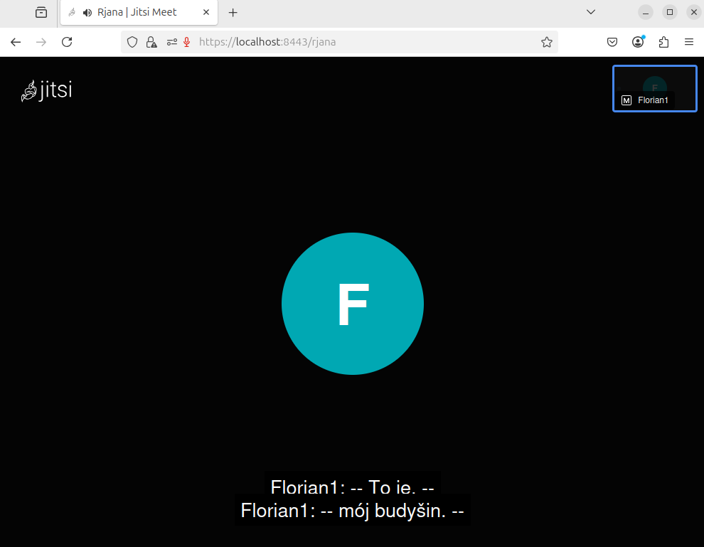
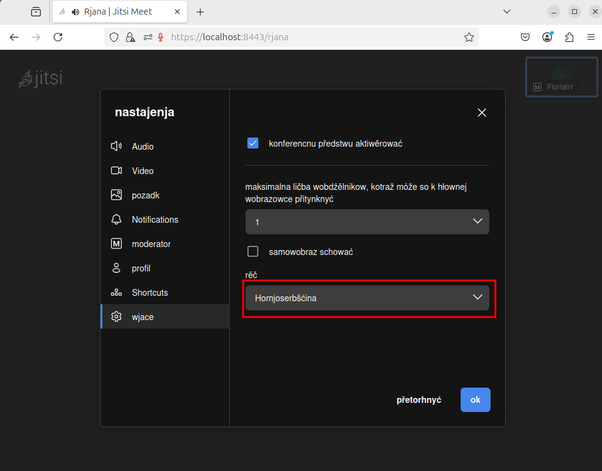
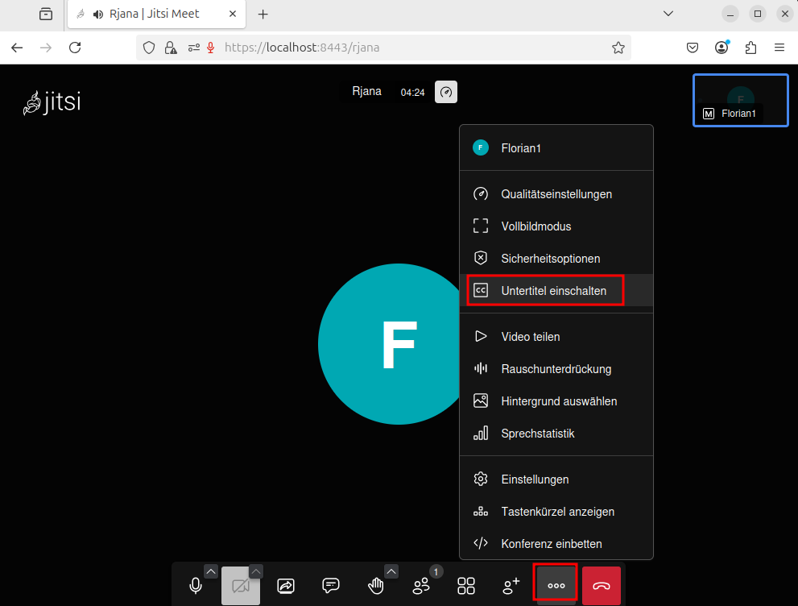
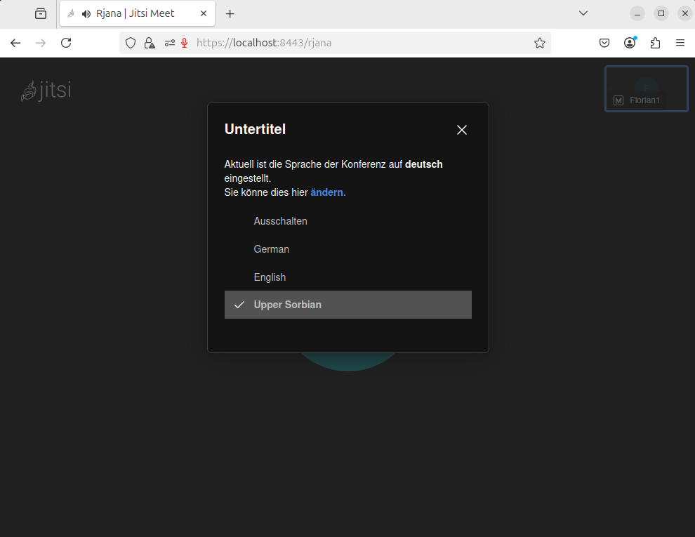

# Jitsi Meetup with HSB support

Jitsi Meet has been customized to support Upper Sorbian (HSB) language features.

This setup enables real-time transcription and translation, including from German (DE) to Upper Sorbian (HSB).



The Jitsi Meet architecture with sorbian transcription and tranlsation:


# Getting Started

```
#
# setup
#

# * create configuration folder with correct permissions 
# * try first a location inside your home directory

sudo rm -fr ~/.jitsi-meet-cfg
mkdir -p ~/.jitsi-meet-cfg/{web,transcripts,prosody/config,jicofo,jvb,jibri,libretranslate/local,libretranslate/keys}
sudo chown -R 1032:1032 ~/.jitsi-meet-cfg/libretranslate


#
# start
#

# * starts a fully configured jitsi meet application
# * uses docker images published on DockerHub
# * it takes around 5-10 min for the app to properly start after all docker images have been downloaded

docker compose -f docker-compose.hsb.yml up


#
# verify
#

# * check if libretranslate is properly running
# * it takes about 5 min to download the language packs (de, en)
# * call API endpoint to see if service is available

curl -X POST http://0.0.0.0:5000/translate -H "Content-Type: application/json" -d '{"q": "Guten Tag!", "source": "de", "target": "en"}'
curl -X POST http://0.0.0.0:5000/translate -H "Content-Type: application/json" -d '{"q": "Guten Tag!", "source": "en", "target": "de"}'
curl -X POST http://0.0.0.0:5000/translate -H "Content-Type: application/json" -d '{"q": "Guten Tag!", "source": "de", "target": "hsb"}'
curl -X POST http://0.0.0.0:5000/translate -H "Content-Type: application/json" -d '{"q": "Witaj k nam!", "source": "hsb", "target": "de"}'


#
# open
#

# * visit localhost and accept opening with invalid SSL Certificate
https://localhost:8443

```

# How to use it? 

* How to set the language?
* How to display subtitles?

```
#
# demonstrate transcription HSB
#

# set language to Upper Sorbian
Menü: (...) -> Einstellungen -> Mehr -> Sprache: Hornjoserbšćina

# set subtitles to Upper Sorbian
Menü: (...) -> Untertitel einschalten -> Upper Sorbian


#
# demonstrate translation DE -> HSB
#

# set language to German
Menü: (...) -> Einstellungen -> Mehr -> Sprache: Deutsch

# set subtitles to Upper Sorbian
Menü: (...) -> Untertitel einschalten -> Upper Sorbian


#
# demonstrate translation DE -> EN
#

# set language to German
Menü: (...) -> Einstellungen -> Mehr -> Sprache: Deutsch

# set subtitles to English
Menü: (...) -> Untertitel einschalten -> English

```







# How to Make Changes

Please visit the following folders for more instruction on how to build your own images:

* libretranslate-proxy: [README.md](libretranslate-proxy/README.md)
* libretranslate-hsb: [README.md](libretranslate-hsb/README.md)
* vosk-hsb: [README.md](vosk-hsb/README.md)


