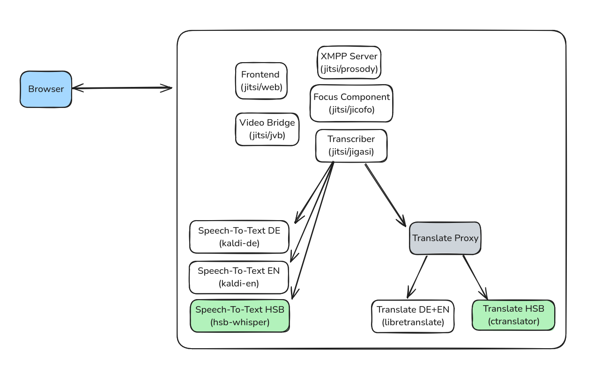

# Translation Proxy

The libretranslate-proxy was created because no sorbian model was available at the time that was libretranslate compatible. It is a temporary solution to demonstrate that transcription and translation work in concert. The proxy will be removed later.




# Getting Started

```
docker build -t fnbk/libretranslate-proxy:250508 .
```

# Debug Libretranslate

```
# start debugging container and connect to docker-compose network
docker network ls | grep jitsi
docker run -it --rm --network docker-jitsi-meet_meet.jitsi --name test-busybox leodotcloud/swiss-army-knife bash

# libretranslate-proxy
curl -X POST http://libretranslate-proxy:5000/translate -H "Content-Type: application/json" -d '{"q": "Wie gehts?", "source": "de", "target": "en"}'

# libretranslate-original
curl -X POST http://libretranslate-original:5000/translate -H "Content-Type: application/json" -d '{"q": "Wie gehts?", "source": "de", "target": "en"}'

# libretranslate-hsb
curl -X POST http://libretranslate-hsb:5000/translate -H "Content-Type: application/json" -d '{"text": "Witaj k nam", "source_language": "hsb", "target_language": "de", }' 

```

